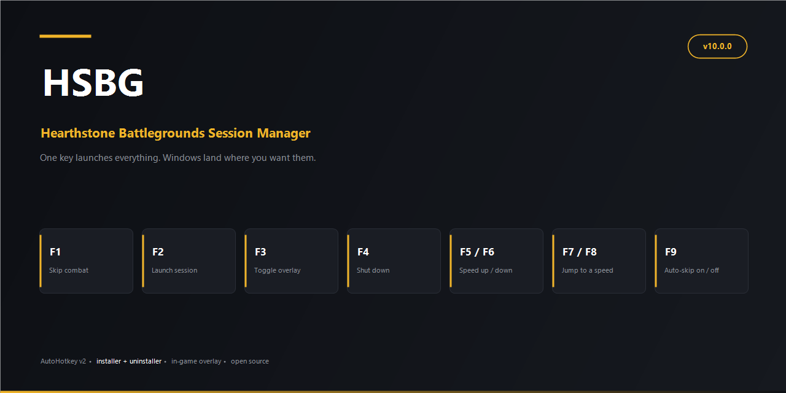



# HSBG — Hearthstone Battlegrounds Session Manager

**Skip combat animations with one key. Launch your whole session with another.**

An AutoHotkey v2 tool for Hearthstone Battlegrounds, installed by a single executable. Four keys, nothing to configure before you start — plus the speed keys, which ship switched off.

| Key | What it does |
|:---:|---|
| **F1** | **Skip the combat animation.** The headline feature. Jump straight to the result of a fight instead of watching it play out. Nothing is lost — the match keeps resolving on Blizzard's servers and you rejoin at the outcome. |
| **F2** | **Start the session.** Battle.net opens, presses Play, and tidies itself away. Hearthstone opens and takes the screen. Your overlay comes up with it. One key, from nothing running to a loaded game. |
| **F3** | **Show or hide your overlay.** Firestone's desktop windows, or the HSReplay tracker's on-screen overlay — whichever you're using this session. Both start hidden; the first press shows them. |
| **F4** | **Shut it all down.** Closes the game, Battle.net, Overwolf and the tracker, puts back everything the script changed, and exits. |
| **F5-F8** | **Animation speed** — *off by default.* Changes the game's animation speed. Unlike the rest of HSBG this works by loading a plugin **inside Hearthstone**, which Blizzard's Terms of Use prohibit and which puts your account at risk. It is a tick-box in the installer, off unless you ask for it. [Read this first.](#animation-speed-off-by-default--read-this-before-switching-it-on) |
| **F9** | **Automatic combat skip — on or off.** Off by default. It does not implement a second skip: it presses F1 exactly as you would, so every safeguard a manual press has applies to an automatic one. It fires the moment the turn ends, only inside a Battlegrounds game, and only once per combat. Turn it on during a shop turn and it skips *that* turn's combat. |

### Why you'd want it

- **Combat skip.** Battlegrounds spends a large share of every game playing out fights you cannot influence. F1 gives that time back, one press at a time.
- **One-key launch.** No clicking through a launcher, waiting, then remembering to start your tracker.
- **Your tracker actually works.** HSBG runs as administrator, which means the Hearthstone it launches does too — and a tracker started any other way can't read an elevated game. That's the *"restart Hearthstone / run as administrator"* message. HSBG starts the tracker itself, at a matching level, and the message never appears.
- **Windows where you want them.** Everything opens on the monitor you started the script from, and the clutter you never asked for — Battle.net's splash and login shells, Firestone's nag popups — simply never appears.
- **Nothing to set up.** Sensible defaults, a settings file that writes itself, and a tray menu for the things worth changing.

### Quick start

1. Download **`HSBG Installer.exe`** from the releases page and run it. It carries everything it needs — nothing is downloaded while it runs.
2. Tick what you want. It installs to your **Downloads** folder and makes a desktop shortcut.
3. **Start HSBG from the shortcut, on the monitor you want to play on** — that is how it knows where to put things.
4. Accept the UAC prompt, then press **F2**.

That is the whole of it. Everything below is detail for when you want it.

> **Use the shortcut, not the `.ahk` file.** Some text editors register themselves as the handler for `.ahk` — Notepad++ does — and on a machine where one has, double-clicking the script opens it as a text document instead of running it. The shortcut calls AutoHotkey directly and is not affected. There is a matching one inside the install folder.

**Requirements** · Windows 10/11 · Administrator rights (for F1's firewall rule and for pausing the Windows Search indexer) · An overlay is **optional** — HSBG supports [Firestone](https://www.firestoneapp.com/) and the [HSReplay deck tracker](https://hsreplay.net/downloads/), uses one at a time, and works normally with neither. AutoHotkey v2.0 is installed for you if you do not already have it. Animation speed (F5–F8) is off by default; ticking it in the installer puts the plugin loader in place and builds the plugin against your copy of the game.

### What's on out of the box

Two things are **on by default**, and both can be switched off in `HSBG Config.ini` — tray icon → *Open settings*. A third, the hotkey sound, is **off** by default and can be switched on there.

| Setting | What it does while it's on | Off |
|---|---|---|
| **`MonitorLock`** | Battle.net, the Blizzard Update Agent, Hearthstone and the on-screen status text all open on the monitor you started the script from. Start it on the screen you want to play on and the rest follows. Firestone's own windows are deliberately exempt, so they stay wherever you put them — usually a second screen. | `MonitorLock=0` — every window opens wherever Windows and the applications decide, and the script never moves anything. Makes no difference on a single monitor. |
| **`HotkeyAudio`** *(off)* | A short, deep guitar note plays each time a hotkey fires, so you know the press registered without looking away from the game. It ships **off**: the feedback was consistent that it was too loud and startling the first time, and a confirmation tone nobody asked for should be opt-in. | `HotkeyAudio=1` — on. |
| **`UpdateCheck`** | Once per run, about ten seconds after start-up, HSBG asks GitHub whether a newer release exists. If one does it says so briefly and offers to download it — see [Updates](#updates). | `UpdateCheck=0` — the script never contacts the network for any reason. |

**The rest of the file is sound tuning and your overlay choice.** The sound settings:

- **`HotkeyAudioVolume`** — `0`–`100`, default `12`. Halved from the old default: these notes sit between 55 and 110 Hz, and a level that reads as comfortable on a quiet desktop reads as loud over a game.
- **`HotkeySoundFile`** — path to your own PCM `.wav`, played for every hotkey in place of the built-in note. Empty by default; a missing file falls back to the built-in tone.
- **`HotkeyFreqMode`** — whether every key sounds the same note, or each key gets its own. This is a **word, not a number**: the file ships with the line `HotkeyFreqMode=singular`, and you change that single word so it reads `HotkeyFreqMode=varied`. Nothing else has to move.
  - `singular` — all four keys play **`HotkeyFreqSingular`**, `110.0` Hz by default. The `HotkeyFreqF1`–`F4` lines are sitting right there in the file but are ignored.
  - `varied` — each key plays its own line instead: **`HotkeyFreqF1`–`F4`**, `82.41`, `110.00`, `73.42` and `55.00` Hz by default, so F1 and F4 are two different presses to your ear. Leave one blank or set it to `0` and that key falls back to `HotkeyFreqSingular`.
  - Pitches are accepted between **20 and 2000 Hz**; anything outside that, or not a number, is ignored in favour of the default and noted in the log. Any spelling other than `singular` or `varied` is read as `singular`.

And the overlay settings — **`Tracker`** and **`HDTPath`** — which decide which overlay this session uses and where to find it. They are covered under [Only one overlay at a time](#only-one-overlay-at-a-time) and [Settings](#settings).

Every one of these is also documented in comments inside the file itself.

### The tray menu

HSBG has no window. It runs as an icon in the **system tray** — the small cluster at the right-hand end of the taskbar, next to the clock. Windows hides new tray icons by default, so click the **`^`** arrow there to reveal it: it is AutoHotkey's green **H**, and hovering it reads *Battle Grounds v10.0.0 — running*. Drag it down onto the taskbar to keep it permanently visible.

**Right-click** that icon for the menu:

| Menu item | What it does |
|---|---|
| **Open settings (HSBG Config.ini)** | Opens the settings file in Notepad. Use this rather than finding the file yourself — the script runs as administrator, so the editor it opens can actually save. |
| **Overlay for this session…** | Re-opens the overlay picker and applies the answer immediately, without restarting. Switching away from Firestone hands its windows back; switching away from HSReplay un-hides a tracker F3 had hidden. Neither overlay is launched or closed by this — the next F2 does that. Says so on screen if only one overlay is installed and there is nothing to choose. |
| **Check for updates now** | Asks GitHub again, without waiting for the next start-up. Useful right after a release is published. |
| **Reload settings** | Re-reads the file and applies what can be applied without a restart — the monitor lock starts and stops cleanly, and the hotkey tones rebuild. *Settings reloaded* flashes on screen when it lands. |
| **Test hotkey sound** | Plays the note, and says on screen whether the script really read `HotkeyAudio=1` and which file it read it from. (The sound is off by default, so this is also how you check it is working after switching it on.) |
| **Test speed cycle (next speed now)** | Steps the cycle forward directly, bypassing the keyboard. If this works but `F5` does not, something else on your PC has taken that key — rebind it in that program. If neither works, the log line it writes on entry says why. |
| **Copy diagnostics to clipboard** | Puts a short, read-only report on the clipboard: build, whether HSBG is elevated, which overlay this session chose, whether Overwolf / Firestone / the tracker are installed and running, whether Hearthstone is up, your monitor layout, and which settings file is actually being read. Paste it into a bug report and it answers most of the questions a first reply would otherwise have to ask. It launches nothing and changes nothing, and it is written to `HSBG.log` as well in case the clipboard is held by the game. |
| **What is under my cursor?**<br>**Log Firestone's windows**<br>**Log Firestone's setting keys** | Diagnostics for when clicks or windows misbehave — see [Troubleshooting](#troubleshooting). The last one is read-only and dumps the on/off settings this Firestone build actually has, which is how you find the one that stops the Battlegrounds window opening by itself. |
| **Get v5.2.0 …** | Appears only when a newer release exists, named for the version it found. Downloads it beside the current script — see [Updates](#updates). |
| **Exit** | Stops HSBG and puts back what it changed. It sits below the separator, among AutoHotkey's own items. |

So changing a setting is: right-click the tray icon → *Open settings* → edit the line → save and close Notepad → right-click again → *Reload settings*. That is the whole procedure.

> **Reload settings is honest about its limits.** The monitor lock and the hotkey tones re-apply live. Everything else in the file was consumed during start-up and is not revisited, so for those, exit from the tray and start the script again.

---

## How it works, in one page

Five independent parts. Each does one job and none of them needs the others to be working.

**The skip (F1).** Battlegrounds hands your client the whole combat up front and then renders it — the result is already decided on Blizzard's servers. F1 adds a firewall rule blocking the match's server address, waits for the client to notice the connection has gone, then removes the rule and lets it reconnect. You rejoin at the outcome. The wait is a *condition*, not a timer: it watches the TCP table and releases the moment the drop is confirmed, with a floor, a confirmation streak and a ceiling. A fixed timer cannot know whether the client has noticed yet — too short does nothing, too long and you are dropped for good.

**The launcher (F2).** Opens Battle.net, presses Play, tidies it away, waits for Hearthstone, puts it on the monitor you chose and brings your tracker up with it.

**Phase detection.** Reads Hearthstone's own `Power.log`, the same file every tracker uses — no pixels, no guessing. Two streams in that file answer different questions and HSBG reads both: `GameState` says when the turn *ends*, which is when auto-skip fires; `PowerTaskList` says what is being *rendered*, which is what the overlay shows and what the speed follows. Using one for both is why combats once appeared to last a second.

**Animation speed (F5–F8, off by default).** A small plugin compiled against your own copy of the game and loaded by BepInEx. It scales the game clock, and the effect toggles attach to specific methods inside Hearthstone. This is the one part that puts third-party code in the game process — see the section below before switching it on.

**Window management (F3).** Trackers are kept off-screen rather than merely transparent, because a window that is not on any monitor cannot be shown by anything. F3 brings them back, arranges Firestone's two windows once per match, and hands the screen back to the game afterwards.

Everything is one readable `.ahk` file. Settings live in `HSBG Config.ini`, which has a comment for every value.

---

## Contents

- [What's on out of the box](#whats-on-out-of-the-box)
- [The tray menu](#the-tray-menu)
- [Hotkeys in detail](#hotkeys-in-detail)
- [The in-game overlay](#the-in-game-overlay)
- [The settings window](#the-settings-window)
- [What it does with each application](#what-it-does-with-each-application)
- [Settings](#settings)
- [Updates](#updates)
- [Diagnostics](#diagnostics)
- [Troubleshooting](#troubleshooting)
- [How it works](#how-it-works)
- [Advanced tuning](#advanced-tuning)
- [Reading the source](#reading-the-source)
- [What it touches on your system](#what-it-touches-on-your-system)
- [License](#license)

---

## Installation

There are two executables on the releases page, and nothing else to fetch.

**`HSBG Installer.exe`** carries HSBG, AutoHotkey v2 and the plugin loader inside it. It finds Hearthstone, installs what you tick, and finishes on a page saying exactly what it did and where each piece went. It installs to `Downloads\HSBG` and creates a desktop shortcut. Everything is ticked by default.

**`HSBG Uninstaller.exe`** is the more important of the two. HSBG writes files outside its own folder, so deleting the folder is *not* an uninstall — the speed plugin would keep loading into Hearthstone on every launch afterwards. The uninstaller removes it, restores Hearthstone's `log.config` and Firestone's settings exactly as they were, puts back any other speed mod it moved aside, and tells you item by item what it undid. AutoHotkey is the one thing left unticked, since you may be using it for something else.

**Starting it.** Use the desktop shortcut. It runs AutoHotkey and hands it the script, rather than opening the `.ahk` and letting Windows decide what that means. Start it **on the monitor you want to play on** — the script takes the monitor it was launched from as your choice, and everything it places afterwards follows it. Accept the UAC prompt; the script elevates itself and hands the launch monitor to the elevated instance, so the choice survives.

The script creates two files beside itself on first run: `HSBG Config.ini` (settings) and `HSBG.log` (diagnostics).

---

## Hotkeys in detail

### `F1` — Combat-animation skip

Skips the Battlegrounds combat animation by forcing the client to reconnect past it.

The script identifies Hearthstone's live game-server connection and blocks that one address, in both directions, for a fixed interval — then releases it. The match continues resolving on Blizzard's servers the whole time, so nothing is lost: you rejoin at the result.

Blizzard's login and services connection (TCP 1119) is deliberately left alive, so there is no re-authentication and no risk to your seat in the lobby. Clicks on the game window are swallowed for the duration, so a stray click cannot disturb the skip.

**Finding the connection: two paths.** The Windows TCP table answers the common case in under a millisecond, and that is what a press normally uses. It cannot report connection creation times or interpret IPv6, so when the answer would be incomplete — two or more connections on the services port, or any IPv6 connection on the process — the press falls through to a fuller PowerShell enumeration that costs most of a second but sees everything. The log records which path each press took, as `F1 lookup=fast` or `F1 lookup=powershell`.

**A press that does nothing says why.** Four refusals, each with its own message, so a key that appears to have done nothing is never a mystery:

| On screen | Means |
|---|---|
| `F1 cooling down…` | Inside the 0.75 s cooldown from the previous press. |
| `No game connection found` | Neither path identified a game connection — see [Troubleshooting](#troubleshooting). |
| `F1 ignored — launch in progress` | An F2 pipeline is genuinely still running. If the flag is stale, F1 clears it and proceeds. |
| `HS not running` | There is no Hearthstone to skip in. |

**When to press it.** Any time from the end of the recruit phase onwards. The hold is sized so that a press made as your turn ends is still in effect once the fight actually begins — which matters, because the skip works by resyncing the client past a combat it has already been handed, and a press made *before* the client has that combat has nothing to skip yet. See `forcefulHoldMs` in [Advanced tuning](#advanced-tuning) for the full reasoning.

The hold is adaptive, not a fixed number: it never releases before 1.2 seconds, watches for the connection to actually come back, and gives up at 4 seconds in the normal safe mode (5 seconds is the hard ceiling). Clicks then stay swallowed for a further 1.5 seconds while the client reconnects — lifting the block is the *start* of the reconnect, not the end of the skip, and a click landing in that window goes to a board that has not finished redrawing.

The Battle.net launcher is held down for the hold and about six seconds after it, which is the window in which a disconnect would otherwise pop it back onto your screen. A failsafe timer removes the block even if the press dies part-way through, and it is re-armed rather than cancelled after a successful release — so an interrupted press cannot leave Hearthstone firewalled off its own game server.

Hearthstone's audio is left alone throughout. The game is never concealed during a skip or a launch, so there is no moment where you would be hearing a game you cannot see.

> **The hold is a condition, not a stopwatch.** F1 blocks the game server's address and waits for Hearthstone to notice. How long that takes is not fixed: press while the client is mid-send and it notices in well under a second; press during a single minion's attack and the client is doing *nothing* on the wire — it was handed the whole combat up front and is only rendering it — so TCP has nothing in flight to go unacknowledged and its detection timer has not even started.
>
> A fixed four-second hold guessed at that, and guessed wrong in both directions: dead time on a fast press, and occasionally lifting before a quiet client had noticed at all, which is a press that silently does nothing.
>
> HSBG now watches instead. The moment Hearthstone's connection leaves the ESTABLISHED state — the exact event being waited for, readable from the TCP table in under a millisecond — the block lifts. Skips that used to take a flat four seconds often finish faster, and the rare mid-combat miss stops happening. A floor (1.2 s) stops an unlucky read cutting a skip short, two agreeing polls are required rather than one, and a ceiling (9 s) means a block aimed at the wrong address can never hang the key.
>
> It also makes failure legible for the first time. The log now records *why* each hold ended — `confirmed` means the drop really registered; `ceiling` means it never did, which tells you the block is on the wrong address rather than that the client was slow. Those two look identical from the chair and need opposite fixes. `f1HoldMode := "fixed"` in the script's `CFG` block restores the old stopwatch exactly.

### `F2` — Launch or restart

Starts a full session, or restarts one already in progress.

```
F2  ─┬─  Battle.net opens  →  presses Play  →  minimises
     │                                           ↓
     └─  your overlay starts                 Hearthstone opens and
         (immediately, in parallel)          takes the foreground
```

**Your overlay starts before Hearthstone, and that order matters — for both of them, for different reasons.**

- **Firestone** reads the game's memory to drive its overlay, so it goes up first and is in place and waiting as the game arrives. Starting it midway through Hearthstone's initialisation makes it attach to a process that isn't ready — which fails with *"CRITICAL ERROR: Could not read the game's memory"* and leaves you with no overlay for the whole session. The `fsLaunchDelayMs` setting exists to delay it and is `0` for exactly that reason.
- **The HSReplay tracker** writes the log settings Hearthstone reads **once, at start-up**. Launch the game first and the tracker asks you to restart it, which costs a whole relaunch. So the Play press is held until the tracker is actually running — capped at 25 seconds, past which Play fires anyway and the log says so.

**The launcher leaves before the game arrives.** Hearthstone opens onto a clear screen and takes the foreground on its own, rather than having the launcher tidy itself away over the top of it. Hearthstone itself is never hidden, muted or resized — fullscreen, borderless or windowed stays entirely your in-game setting.

Pressing F2 while Hearthstone is already running restarts it cleanly, closing the game and the Blizzard processes first.

**If the game doesn't start.** Pressing Play does not always launch anything — there may be a patch to download, or Battle.net may want you to sign in. Rather than sitting minimised waiting for a game that isn't coming, the launcher restores itself after 25 seconds, says so on screen, and keeps re-pressing Play in the background. A finished download is picked up automatically and the launcher minimises again. It waits up to 30 minutes, which covers a large patch.

A stalled launch is recovered rather than left hanging: the pipeline has a five-minute ceiling, time spent on the Battle.net login screen does not count against it, and a game that appears after the ceiling is still picked up.

### `F3` — Show or hide your overlay

**What F3 toggles depends on which overlay this session is using.** Under Firestone it is the desktop windows; under HSReplay it is the tracker's on-screen overlay. Everything in the rest of this section describes the Firestone case; [the tracker case is below](#f3-under-the-hsreplay-tracker).

**F3 never opens the overlay picker.** It can arrive mid-match, and a dialog over a live board is not an acceptable answer to a keypress. If the choice is unambiguous — one overlay installed, or a `Tracker=` setting pinned — F3 uses it. If both are installed and no F2 has settled the question yet, F3 does nothing at all.

Toggles the Firestone desktop windows (Main and Battlegrounds). They start hidden — and the **Battlegrounds** window *stays* started-hidden: Firestone builds that window lazily, at your first match of a session, and it is concealed at birth even if you happened to have the overlay revealed at that moment. It joins the toggle set and comes up with everything else on the next press. A Battlegrounds window you have never summoned can no longer put itself onto your screen mid-match; F3 is the way in. (Once you *have* revealed it, it behaves normally — while the overlay is shown, Firestone is free to bring it back at each match, which is what showing the overlay means.)

**That start-hidden rule applies to the Battlegrounds window only, and the narrowness is deliberate.** It briefly applied to Main as well, on the reasoning that Main is always born hidden anyway. It isn't: Main is *destroyed* when you close it and *created again* when you click Firestone's tray icon, so "a window nobody has ever seen" was also true of a Main you were opening right then. It vanished the instant you opened it, and F3 then felt broken because the lock state no longer matched the screen. Three conditions now fence the rule in — the window must be Battlegrounds, Hearthstone must be running, and it must not have arrived holding the foreground. Anything you opened by clicking is left alone.

**The Settings window is the exception in the other direction: HSBG never hides it.** Open Firestone's settings from its window or its tray icon and it appears and stays put, whatever state F3 is in — locked, unlocked, mid-launch. You opened it, so it is yours to close. (Earlier builds fought themselves over this window, which is why it sometimes vanished the moment it opened.)

**F3 does nothing until Firestone Main has opened** — no toggle, no sound, no acknowledgement. Before that point there is nothing to show, and pressing it would disarm the concealment for the very window it was armed for, so Main would arrive on screen visible. An early press is silent and costs nothing: it is not queued and not remembered, so the first press after Main opens behaves as the first press.

Presses inside 250 ms of each other are dropped. The note still plays — the tone fires before the debounce — but the toggle and its on-screen message do not, so you hear the key and nothing moves. Rapid re-toggling style-flaps the underlying Chromium window, which is the documented way to wedge a Firestone Main that is still forming.

**Main and Battlegrounds are concealed differently, and the difference is deliberate.** The Battlegrounds window — like the rest of the Firestone family — is cloaked, stripped of its taskbar button and moved off the virtual desktop; F3 puts it back at the exact rectangle it was taken from. **Firestone Main is minimized instead.** It is cloaked and loses its taskbar button the same way, but its geometry is left completely alone.

The reason is Chromium. To it a visibility change is not a cheap flag: hiding a window tears down and rebuilds the compositor's frame sink, and a renderer put through enough of that stops coming back — which is the mechanism behind every *"Firestone Main did not survive"* in this project's history. A minimized window keeps `WS_VISIBLE` set, so Chromium is never told its window went away and there is nothing to rebuild. Windows itself remembers where the window was, so F3 restores it precisely without HSBG owning a second opinion about its position. (`fsMainConcealPolicy` in the script's `CFG` block selects `"park"` to give Main the family treatment instead.)

**The two are never combined on one window.** Minimizing captures the restore rectangle at that instant — so parking first would mean Windows restoring the window to a position outside the virtual desktop, and F3 handing back something nobody can see. One window, one position authority.

These windows are **deliberately exempt from the monitor lock.** They are what you read while playing, so they belong wherever you put them — usually a second screen, beside the game rather than over it. Their position is preserved across a hide and restored when they come back, so move one wherever you like and F3 will keep it there.

**Three things F3 never touches.** The in-game overlay is always visible, whatever the lock state. The Settings window is never concealed, as above. And Firestone's notification popup — the "Your abilities are ready!" window — is not a toggle target at all; it is closed on sight and never painted.

> **On the last frame of the Battlegrounds flicker.** Firestone builds its Battlegrounds window lazily, at your first match of a session — so it gets exactly one chance to be caught, with no pre-armed cloak from an earlier show to fall back on. HSBG now cloaks it on the *second line* of its window hook, using a process-ID comparison rather than a process-name lookup, which removes an `OpenProcess` round-trip from the critical path. That shrinks the gap; it does not close it.
>
> It cannot be closed from here, and the reason is structural rather than a matter of effort. The hook is `WINEVENT_OUTOFCONTEXT`: Windows *queues* the notification to HSBG and delivers it after the window already exists. Getting in front of a window's first paint would mean running code inside Overwolf's own process, which HSBG does not do and will not do.
>
> The complete fix belongs to Firestone: if the window is never created, there is nothing to catch. The tray item **Log Firestone's setting keys** dumps the on/off settings your Firestone build actually has (read-only — it writes nothing) into the log. If one of them turns out to control whether the Battlegrounds window opens on its own, turning it off there gives you zero flicker, permanently.

> **The in-game overlay is now identified by its shape, not only by its name.** Every protection for it used to be keyed on the exact window title `Firestone - Overlays` — and on at least one current Firestone build that title does not exist; the overlay is simply called `Firestone`. HSBG was therefore treating the surface you pin comps to as an ordinary desktop window: cloaking it, and parking it off the desktop. The two janitors that exist to rescue it were matching a title no window ever carried, so neither ever ran. If pins would not stick, or clicks landed on the wrong minion, that is why. The overlay is now recognised structurally — no title bar, tool-window styles, and large enough to cover the game — which no rename can break. Every other Firestone window has a title bar and is smaller, so nothing else can be mistaken for it.
>
> The same misidentification worked in the other direction for **Settings**: it is 780 × 620, which sits inside the notification-popup size envelope, and it is called plain `Firestone` until Overwolf finishes naming it — so the popup closer was sending it a close message before the never-conceal list could recognise it. Windows with a real title bar are no longer treated as notifications.

#### `F3` under the HSReplay tracker

Shows and hides the tracker's on-screen overlay. It **starts hidden**, matching Firestone: F2 arms the hidden state before the tracker has created a single window, each window is concealed as it appears, and your first F3 press brings the overlay up. (`hdtStartHidden` in the script's `CFG` block reverts to the old starts-shown default.)

> **HSBG changes two of the tracker's own settings, and you should know which.** Before starting it, HSBG sets `ShowSplashScreen` to `false` and `StartMinimized` to `true` in the tracker's `config.xml`. This is the only way to make its start-up genuinely flicker-free: HSBG's window hook is delivered through the message queue, so during a busy launch the create notification arrives *after* the window is already on screen, and no amount of hiding can unpaint a frame that has been drawn. Turning the two windows off at the source removes the race instead of losing it. The file is only touched while the tracker is not running, nothing else in it is modified, and your original is kept beside it as `config.xml.hsbg-original`. Set `hdtQuietStart` to `false` in the script's `CFG` block to leave the tracker's settings alone.

**Its start-up is hidden too, the same way Firestone's is.** Tracker windows born while F3 has it hidden — including everything it creates during its own launch — are caught in two stages. At the moment the window is **created** it is DWM-cloaked, which costs nothing on a window that has never been shown and means that when the tracker does display it a moment later it composites nothing. When the window is actually **shown**, it is hidden properly and recorded. The 400 ms poll stays as a backstop.

The split matters: the cloak has to happen at creation to beat the first frame, but the *hiding* must not, because a window the tracker never intended to show is not one HSBG owes back — recording it would mean F3 later dumping windows onto your screen that were never on it. The two stages have separate ledgers for exactly that reason, and both are released on F3, F4, a mode switch and exit.

The tracker's launcher stub no longer flashes a console window on its way through either.

**F3 brings it out over the game.** Showing the tracker pins its windows above a borderless-fullscreen Hearthstone, exactly as F3 does for Firestone's windows. It previously just un-hid them, which restores a window at its old position in the stack — behind the game on a single monitor — so F3 "showed" an overlay you could not see. The pin does **not** take focus away from Hearthstone: a borderless Unity window that loses the foreground re-runs its display setup and snaps back to its remembered monitor, which is the flicker three other parts of this script are written to avoid. Clicking the tracker still focuses it normally. (`hdtRevealForeground` in the script's `CFG` block turns the pin off.)

The pin is **only ever added to a window that was not already always-on-top**, and it is taken off again when that window is hidden, on F4, on a mode switch and on exit. A pin nobody removes is a window stuck above every other application on the machine for the rest of the session — and beyond, because the setting lives in the window rather than in HSBG. The tracker's own overlay is always-on-top by design and is left exactly as it is.

**The on-screen message reads `HSR Unlocked` / `HSR Locked`**, matching the `FS Unlocked` / `FS Locked` you get under Firestone. With both overlays installed, F3 belongs to whichever one the session chose, and the message is how you can tell which without guessing.

Panels the tracker creates *while* F3 has it hidden — the Battlegrounds leaderboard at the start of a lobby, the combat simulator when a fight resolves — are caught and concealed too, so nothing leaks back onto the screen. So are windows the tracker shows again by itself: it re-displays its overlay on game-state changes, and those get put back under. That second check runs about two and a half times a second (every 400 ms) as a backstop, so a disagreement between HSBG and the tracker reads as a slow blink instead of a strobe, and it gives up after 25 rounds on the same window and leaves it visible — a visible overlay is a cosmetic complaint, an overlay flickering for a whole session is not. The log says `HDT-HIDE ... standing down` if that ever happens.

**It always comes back.** On the next press, on F4, on a tray exit, and on any crash on the way out — HSBG hides those windows, so it is responsible for giving them back, and a concealment outlives the script that applied it. And if HSBG is killed outright (Task Manager, a power cut) while the tracker is hidden, **the next HSBG start-up gives those windows back** — it looks for tracker windows that are both hidden and DWM-cloaked, which is a combination only HSBG produces, and un-conceals them. Previously that state was unrecoverable except by restarting the tracker.

Nothing else about the tracker is touched: not moved, not resized, not monitor-locked, not restyled.

### `F4` — Shutdown

Closes Overwolf, Battle.net, Hearthstone and the HSReplay tracker, restores everything the script changed, and exits.

**The tracker is closed like everything else in the session, with no condition attached.** It is asked to close first — `taskkill` without `/F` — because it writes match statistics as it plays and a forced kill mid-write is how a stats file gets truncated. If it has not gone within two seconds it is forced.

**Anything F3 had hidden is closed while still hidden — nothing is shown first.** That applies to both overlays. For the tracker it always did; for Firestone it did not, and the difference was visible: the suppressors that keep Firestone's windows out of sight were switched off *before* Overwolf was killed, so in that gap Overwolf re-showed the windows you had hidden and they flashed on their way out. Overwolf is now killed first, while the suppression is still holding, and there is nothing left to re-show. A concealed window receives a close request perfectly well, so there is nothing to gain from showing it. The guarantee that a concealment never outlives HSBG is kept where it actually applies: if the polite close *and* the forced kill both fail, the surviving windows are revealed rather than left hidden with nothing running to give them back.

Also available as a held-key fallback, so it still works when a fullscreen game is swallowing window messages. That fallback only arms while Hearthstone is running, and only responds to an unmodified F4.

> `Alt+F4`, `Ctrl+F4` and `Win+F4` are passed straight through to Windows. Only an unmodified F-key triggers HSBG.

---

### Animation speed *(off by default — read this before switching it on)*

Cycles Hearthstone's animation speed through `1.0 → 1.5 → 2.0 → 3.0 → 4.0 → 6.0 → 8.0` and wraps around. The current speed flashes on screen with each press.

> [!WARNING]
> **This one is not like the others, and it carries a real risk to your account.**
>
> Every other feature in HSBG arranges windows that Windows already lets you arrange, or resets a network connection you already own. This one works by loading a **plugin inside Hearthstone itself** — a small DLL, loaded by [BepInEx](https://github.com/BepInEx/BepInEx), that writes to the game's `Time.timeScale`.
>
> That is third-party code running inside the game process. **Blizzard's Terms of Use prohibit it**, anti-cheat is specifically built to detect that shape of modification, and Battlegrounds is played against seven other people who are waiting on the same clock. If you use this, the account you are risking is your own, and a suspension is a plausible outcome rather than a theoretical one.
>
> It ships **off**. Nothing about it runs, compiles or installs anything unless you turn it on deliberately.

**It does nothing at all until you install BepInEx yourself.** HSBG does not download, bundle or install it, and will not do so silently. Without it, the speed keys say exactly that on screen and change nothing.

---

#### Installing BepInEx

**What it is and why it is needed.** Animation speed is a value inside the game (`Time.timeScale`), living on Hearthstone's own memory. AutoHotkey runs *outside* the game — it can move windows and block network connections, but it cannot reach in and change that value. So HSBG builds a tiny plugin that does it from the inside. A plugin sitting on disk is just a file, though; something has to load it into the game. [BepInEx](https://github.com/BepInEx/BepInEx) is that loader, and it is the only part HSBG cannot do for you.

It works by putting a file called `winhttp.dll` next to `Hearthstone.exe`. Windows looks in a program's own folder before it looks in the system folder, so Hearthstone loads that file instead of the real one — and it is BepInEx, which then starts everything else. This is why **the folder you put it in is the entire trick**, and why it must be the Hearthstone folder rather than HSBG's.


**Step 1 — get a BepInEx build that includes an unstripped corlib.**

This is the part that catches everyone, so read it before downloading anything.

You need **BepInEx 5.4.23.2 (win-x64)** *plus* a folder of complete .NET assemblies at `BepInEx\unstripped_corlib\`. **The stock BepInEx download does not contain that folder**, and without it nothing works — see the warning below. Community bundles aimed at Unity games ship both together, already wired up; that is what you want.

A correct bundle unzips to this, and the last two lines are the ones to check for:

```
winhttp.dll
doorstop_config.ini
BepInEx\core\              ← BepInEx.dll, 0Harmony.dll, …
BepInEx\plugins\           ← HSBG writes HSBGSpeed.dll here
BepInEx\unstripped_corlib\ ← ~18 assemblies incl. a large mscorlib.dll
```

and its `doorstop_config.ini` already contains:

```ini
dll_search_path_override = BepInEx\unstripped_corlib
```

If your download has no `unstripped_corlib` folder and no `dll_search_path_override` line, it is the stock build and it will not work here.

> [!WARNING]
> **Why the stock BepInEx fails, silently.**
>
> Hearthstone ships a **reduced `mscorlib`**. Unity builds against a restricted API profile, and the result is missing methods ordinary .NET code assumes exist — including `System.Reflection.Module.GetPEKind`, which BepInEx's loader calls while starting up. On a real install the difference is stark:
>
> | | size | has `GetPEKind` |
> |---|---:|:---:|
> | Hearthstone's `mscorlib` | 2,788,352 | no |
> | `unstripped_corlib\mscorlib.dll` | 4,632,064 | yes |
>
> So the loader throws before it reaches a single plugin, and the failure is close to invisible: the game starts normally, the proxy DLL loads, and nothing appears in any log you would think to open. `dll_search_path_override` tells Mono to look in the unstripped folder *first*, and the game's own `Managed` folder stays behind it in the search path — so the game still gets its own assemblies for everything else, and only the missing pieces are answered from the override.
>
> **HSBG checks for this.** If the folder is missing, or present but not referenced in `doorstop_config.ini`, the speed keys say so by name instead of doing nothing.

> [!NOTE]
> **Do not use BepInEx 6.** It is newer, but its loader hits the same `GetPEKind` wall and its assembly layout differs (`BepInEx.dll` is split into `BepInEx.Core.dll` and `BepInEx.Unity.Mono.dll`). HSBG can build against either — it detects which is installed — but 5.4.23.2 with an unstripped corlib is the combination known to work on Hearthstone.

**Step 2 — put the files in the Hearthstone folder.**

Your Hearthstone folder is normally:

```
C:\Program Files (x86)\Hearthstone\
```

It is the folder containing `Hearthstone.exe`. If yours is elsewhere, use that one, and tell HSBG where it is with `HearthstonePath=` in `HSBG Config.ini`.

Open the `.zip` and copy **the contents** into that folder — not the zip's own folder. When you are done it should look like this:

```
C:\Program Files (x86)\Hearthstone\
    Hearthstone.exe              ← already there
    UnityPlayer.dll              ← already there
    winhttp.dll                  ← NEW, and it must sit right here
    doorstop_config.ini          ← NEW
    .doorstop_version            ← NEW
    BepInEx\
        core\                    ← NEW
        plugins\                 ← HSBG writes HSBGSpeed.dll here
        unstripped_corlib\       ← NEW, and nothing works without it
```

> [!IMPORTANT]
> **The most common mistake is one folder too deep.** If you end up with a path like `Hearthstone\BepInEx_win_x64_5.4.23.2\winhttp.dll`, nothing will happen — Windows only preloads that file when it is directly beside `Hearthstone.exe`. Drag the *contents* out of the zip's folder, not the folder itself.

> [!TIP]
> **If the game still ignores it, copy `winhttp.dll` and name the copy `version.dll`.**
>
> Doorstop only loads if the game imports the DLL it is impersonating. `UnityPlayer.dll` imports both `WINHTTP.dll` and `VERSION.dll`, but depending on load order Windows may resolve `winhttp` from `System32` rather than from the game folder — in which case the copy in the game folder is simply never loaded, silently.
>
> This is safe because the file is a *universal* proxy: it exports both sets of functions (`WinHttpOpen…` **and** `GetFileVersionInfoW`, `VerQueryValueW`…), so whichever name it is given, the game gets what it asked for. Keep both files; only one will load.

> [!TIP]
> **Copy `winhttp.dll` again and name the copy `version.dll`.** Same file, second name — and on Hearthstone it is the one that actually works.
>
> Doorstop only loads if the game imports the DLL it is impersonating. `UnityPlayer.dll` imports both `WINHTTP.dll` and `VERSION.dll`, but Hearthstone resolves `winhttp` from `System32` rather than from the game folder, so the `winhttp.dll` copy is simply never loaded — silently. `version.dll` is resolved from the game folder and works.
>
> This is safe because the file is a *universal* proxy: it exports both sets of functions (`WinHttpOpen…` **and** `GetFileVersionInfoW`, `VerQueryValueW`…), so whichever name it is given, the game gets the functions it asked for. Keep both files; only one will load.

Windows will ask for administrator permission, because this is inside `Program Files`. That is expected; accept it.

**Step 3 — start Hearthstone once, on its own.**

Launch the game normally and let it reach the menu, then close it. This is BepInEx proving it works. Check that this file now exists:

```
C:\Program Files (x86)\Hearthstone\BepInEx\LogOutput.log
```

If that file appeared, BepInEx is loading. If it did not, `winhttp.dll` is in the wrong place — go back to Step 2.

**Step 4 — turn the feature on in HSBG.**

Tray icon → *Open settings*, and change one line:

```ini
AnimationSpeedEnabled=1
```

Save, close Notepad, then exit HSBG from the tray and start it again. On this start HSBG compiles the plugin using the C# compiler already built into Windows, and copies it to:

```
C:\Program Files (x86)\Hearthstone\BepInEx\plugins\HSBGSpeed.dll
```

**Step 5 — restart Hearthstone one more time.**

BepInEx only looks in `plugins\` when the game starts, so the plugin cannot load in the session that installed it. **The speed keys will do nothing until this restart.** This catches almost everybody once.

**Checking it worked.** Open `BepInEx\LogOutput.log` and look for:

```
HSBG: TimeScaleMgr.Update suppressed.
```

That line is the important one. It means HSBG has stopped Hearthstone overwriting the speed sixty times a second — without it the game wins and nothing changes. Then press F6 in a match: the on-screen text should read `HS speed 1.50x` with nothing after it. Any text *after* the number is HSBG telling you what is still missing.

**If it stops working later.** Blizzard's launcher repairs and patches can delete `winhttp.dll`. Check that the file is still next to `Hearthstone.exe` before assuming HSBG broke. If instead the log says `TimeScaleMgr type not found`, a game patch has renamed something inside Hearthstone — the speed keys simply stop having an effect, and nothing else is harmed.

**Removing it.** Delete `winhttp.dll`, `doorstop_config.ini`, `.doorstop_version` and the `BepInEx` folder from the Hearthstone folder. The game returns to normal immediately; nothing else in HSBG depends on any of it.

---

#### The four speed keys

| Key | What it does |
|:---:|---|
| **`F5`** | **Faster** — next speed up the cycle. Wraps round to the start. |
| **`F6`** | **Slower** — next speed down. Wraps round to the end. |
| **`F7`** | Jumps straight to `SpeedKeyF7` (default `4.0`). |
| **`F8`** | Jumps straight to `SpeedKeyF8` (default `8.0`). |

**Every one of them shows the change on screen**, as a transition rather than a destination:

```
HS speed  2.00x  →  4.00x   (3 of 4)
HS speed  4.00x  →  8.00x   [F8]
```

That answers *did it register*, *by how much* and *where am I in the cycle* in one line. A speed change with no confirmation is invisible unless the step is large enough to feel, which is exactly how you end up unsure whether the key worked.

**The default cycle runs `1.0` to `8.0` in `0.5` steps.** Every press is one notch, so nothing in the range is more than a few presses away and you can settle on the speed you actually want rather than the nearest power of two. `F5` walks up it, `F6` walks down, and both wrap. The starting speed is `1.0` — normal — so HSBG changes nothing about the game until you press a key. Edit `AnimationSpeedCycle` to any list you like; it is walked in order and both keys respect it.

`F7` and `F8` exist because cycling is the wrong interaction for the two speeds you actually use — a normal one and a get-through-this one. Hunting for either by tapping `F6` during a combat phase is worse than not having the feature. They do **not** have to be members of the cycle.

> **If `F5` does nothing, something else has taken it.** It is the most heavily squatted key in this range — Overwolf, NVIDIA's overlay, Discord and Steam all bind F-keys by default, and whichever registered first owns it. A hotkey claimed by another process never reaches HSBG at all: no HUD, no log line, nothing, which is impossible to tell apart from a broken script, and nothing on HSBG's side can win it back. Check that program's own hotkey settings and rebind it there. Rule out the keyboard itself too — a dead key and a stolen one look identical from HSBG's side, and at least once the key really was broken.

#### Animation speed settings

| Setting | Meaning |
|---|---|
| **`AnimationSpeedEnabled`** | `0` (default) — off, and nothing is compiled or installed. `1` — on. |
| **`AnimationSpeedDefault`** | Speed applied at start-up. `1.0` is the game's own speed and is the default. |
| **`SpeedKeyF7`** / **`SpeedKeyF8`** | One speed each, jumped to directly by F7 and F8. A single number between `0.25` and `16.0` using a dot — `1.0` is normal, `2.0` twice as fast, `0.5` half. Valid: `1.0` `2.5` `4.0`. Invalid: `4x`, `fast`, `4,0`, `100`. Anything out of range or unparseable is ignored, noted in the log, and the key keeps its default. These need not appear in the cycle. |
| **`AnimationSpeedCycle`** | The comma-separated list `F5` and `F6` walk through, in both directions. Values outside `0.25`–`16.0`, and anything that is not a number, are dropped with a note in the log. |
| **`HearthstonePath`** | Only needed if your install is somewhere HSBG cannot find on its own. |

**The speed is handed back on every exit.** HSBG writes the chosen value to a small bridge file that the plugin reads; on exit — F4, tray exit, reload or crash — that file is reset to `1.0`. Without this, a session that ended at 8× would leave Hearthstone running at 8× the next time you launched it with HSBG closed, with nothing on screen to explain why.

> `Alt+F6`, `Ctrl+F6` and `Win+F6` are passed straight through to Windows, as with every other HSBG hotkey.

---

## The in-game overlay

A narrow column on the left edge of the screen while Hearthstone is running. Top to bottom: the **HS/BG** mark, which is also the handle you drag it by; a dot and a word for the phase you are in; the speed currently in force; **MENU**; and a legend of the hotkeys.

**Left edge on purpose.** The board is centred, and both Firestone and the HSReplay tracker put their overlays on the right by default — so anything of ours on the left is clear of both without you rearranging anything. Drag it wherever you like; the position is remembered.

**It never takes keyboard focus.** Windows only hides the taskbar for a fullscreen window that is *also* the foreground window, so an overlay that stole focus when clicked would put the taskbar back over your game every time you used it. Clicking any part of this one leaves Hearthstone in front.

**MENU opens the settings window** — that is all it does. There is no cog to recognise and no popup menu offering you one more click before the thing you wanted.

**The readouts are readouts.** Clicking the phase, the dot or the speed does nothing, and there is no skip button on the strip. A control that changes the game does not belong on the surface most likely to be clicked by accident, right where the eye goes to read the current state — a misclick during a combat would otherwise retune the speed for every future combat, silently, because a manual change is remembered.

**The legend is clickable**, and a click presses the real key: same cooldowns, same connection check, same guards. `F4` is the exception. It is listed, because knowing the key exists is the point of a legend, but it is not wired up — it closes the game, Battle.net, the tracker and HSBG, and a stray click on a strip sitting over a live board should not be able to end your session.

---

## F3 and the two Firestone windows

Firestone Main is kept off screen from the moment it is created until your first F3 — not hidden behind a transparency setting, but moved off the virtual desktop entirely, which is the same treatment the Battlegrounds window gets and the reason that one has never flickered. A window that is not on any monitor cannot be shown by anything.

**The first F3 of a match arranges the pair**, once: Main on the left, Battlegrounds overlapping its advertising column so the two read as one wide panel with hero statistics where the ad was. They are centred on the monitor they were already on — Firestone's windows are deliberately outside HSBG's monitor-locking, so this tidies them where you had them rather than relocating them. Battlegrounds is raised above Main and takes the foreground, and Firestone is asked to open on **Hero selection** rather than whatever tab it closed on.

The move happens while both windows are cloaked, so the first frame you see is the final position rather than the pair appearing where Firestone last had them and jumping.

**Every F3 after that just parks and unparks.** Nothing is moved or resized again, so anything you drag stays where you put it for the rest of the game.

---

## The settings window

Everything on one page, in two columns: speed, combat skip, overlay, visual effects and general. Open it from **MENU** on the strip, or from the tray menu.

It writes the same `HSBG Config.ini` that has always been the source of truth and reloads it, so nothing needs restarting and hand-editing still works exactly as before. **Save** applies; **Cancel** discards; **Open HSBG Config.ini** takes you to the file itself, which documents several settings this window does not show.

**It opens on the monitor the session is locked to**, not wherever Windows decides, and it is owned by the Hearthstone window — so opening it does not count as leaving the fullscreen game and the taskbar stays down.

**Speeds are not limited to the presets.** The slider walks the presets for the common case; the box beside it takes any number you type, whether or not it appears in the configuration file. It is clamped when you save, not while you are typing — otherwise a half-finished `1` on the way to `12` would be rewritten under your cursor.

**Resizing moves the contents.** Extra width is shared between the two columns rather than given to the background, and the window repaints once per gesture rather than once per control.

---

## What it does with each application

Four applications are involved in a Battlegrounds session. Left alone they produce a cluttered, slow, multi-step start-up with windows scattered across monitors.

| Application | What HSBG does with it |
|---|---|
| **Battle.net** | Opens on your chosen monitor, starts the game, and minimises *before* the game window arrives. "Starts the game" is not a simulated click — HSBG runs `Battle.net Launcher.exe` with Blizzard's own game argument, the documented launch route, so nothing depends on where a button happens to sit or what the launcher looks like this month. There is no mouse automation anywhere in HSBG. Its service surfaces — boot splash, auto-login shell, maintenance alerts, Update Agent — never appear. If the game cannot start because an update or sign-in is pending, the launcher comes back and says so. Held down during an F1 skip, so a disconnect cannot pop it onto your screen mid-game. |
| **Hearthstone** | Launched, then left alone. Never hidden, muted or resized. The only thing the script decides is which monitor, and only if the game landed on the wrong one. |
| **Overwolf** | Started immediately on F2, in parallel with Battle.net, so it is ready by the time the game is. It is launched with `-overwolfsilent`, which suppresses the "Launching app on Overwolf" panel that would otherwise flash on screen a couple of seconds into every cold start. |
| **Firestone** | Optional. Its in-game overlay stays visible and untouched at all times; its desktop windows stay out of sight until you ask for them; its Settings window is never hidden; its notification popup is closed on sight. If Firestone is **not installed**, every Firestone subsystem stays dormant and the rest works normally. If it is installed but you picked the tracker instead, most of them stand down — with [one exception](#only-one-overlay-at-a-time). |
| **HSReplay tracker** | Optional. Started on F2, at administrator level so it matches the game, and then left alone: never moved, resized, monitor-locked or restyled. It starts hidden; F3 shows and hides it. F4 closes it. |

### Only one overlay at a time

Firestone and the HSReplay tracker draw the same information in the same place. Two of them on one board is two sets of panels competing for the same pixels and two processes attached to the same game, so HSBG uses one per session.

- **Only one installed** — it is used, silently. Nothing to ask.
- **Both installed** — F2 asks, once, and remembers the answer **for that session only.** Restart HSBG and it asks again. Change your mind mid-session from the tray menu: *"Overlay for this session…"*.
- **Neither** — F2 launches Battle.net and Hearthstone and nothing else, and F3 does nothing.
- **Want to stop being asked** — set `Tracker=firestone` or `Tracker=hsreplay` in `HSBG Config.ini`.

**The picker cannot hang a launch.** It waits 30 seconds for an answer and then defaults to Firestone and gets on with it, which is also what closing it or pressing Escape does — closing the window is "leave it as it was", and for a script that has always launched Firestone, that is Firestone. A second F2 while it is open does not stack a second dialog.

**A pinned setting that names something you don't have falls back rather than launching nothing.** `Tracker=hsreplay` on a machine without the tracker reverts to ordinary detection and logs why, because silently starting no overlay at all is the failure that costs an evening.

The overlay you don't pick is **never launched, moved or closed by a hotkey**, and the tracker in particular is untouched in every respect when Firestone is the choice.


---

## Settings

`HSBG Config.ini` sits next to the script. It is created on first run with every setting documented inside it as comments, so you never need to open the script — or this page — to change your mind. Delete it and it comes back with the defaults.

**To edit it: right-click the tray icon → "Open settings".** ([Where the tray icon is.](#the-tray-menu)) That route matters. The script runs elevated, so the editor it opens is elevated too; if the file happens to live somewhere only an administrator can write, opening it any other way lets you make changes and then refuses to save them.

**Where the file lives is decided by testing, not assumed.** An existing `HSBG Config.ini` beside the script always wins — that is portable mode, and whoever put it there meant it. Otherwise, the script's own folder if it is genuinely writable, and `%APPDATA%\HSBG\` if it is not. Whichever won is named in the start-up log line and reachable from the tray menu, so there is never a question about which file is being read.

| Setting | Default | Effect |
|---|---|---|
| `MonitorLock` | `1` | Put Battle.net, the Update Agent, Hearthstone and the status text on the monitor you started the script from. `0` leaves every window where it opens and moves nothing. No effect on a single monitor. |
| `HotkeyAudio` | `0` | Play a short, deep note when a hotkey fires, so a press is confirmed without looking away from the game. **Off by default** — the feedback was consistent that it was too loud and startling on first press. `1` turns it on. |
| `HotkeyAudioVolume` | `12` | `0`–`100`. Ignored while `HotkeyAudio=0`. Halved from the old default: these notes sit between 55 and 110 Hz, and a level that reads as comfortable on a quiet desktop reads as loud over a game. |
| `HotkeySoundFile` | *(empty)* | Path to your own PCM `.wav`, played for every hotkey instead of the built-in note. Falls back to the built-in tone if the file is missing. |
| `HotkeyFreqMode` | `singular` | A word, not a number. `singular` — every key sounds the same note. `varied` — each key gets its own pitch. Any other value is read as `singular`. |
| `HotkeyFreqSingular` | `110.0` | Pitch in Hz used by every key in `singular` mode, and the fallback for an unset key in `varied` mode. |
| `HotkeyFreqF1`–`F4` | `82.41`, `110.00`, `73.42`, `55.00` | Per-key pitches used in `varied` mode; ignored in `singular`. Blank or `0` falls back to `HotkeyFreqSingular`. |
| `Tracker` | `ask` | Which overlay to use. `ask` — if both are installed, F2 asks and remembers for that session only. `firestone` / `hsreplay` — always that one, never asks. `none` — neither; F2 launches only the game, F3 does nothing. |
| `HDTPath` | *(empty)* | Path to the HSReplay tracker, if the automatic lookup misses it. Point it at either `HearthstoneDeckTracker.exe` or the `Update.exe` beside it. A path that does not exist is ignored, with a log line, and the usual lookup runs instead. |
| `UpdateCheck` | `1` | Ask GitHub once per run whether a newer release exists — see [Updates](#updates). `0` means the script never contacts the network for any reason. |
| `UpdateOwner` | *(empty)* | Which GitHub account the update check asks. Empty means the one this script was published from. Only useful for a fork, or for testing the update path itself. |
| `UpdateRepo` | *(empty)* | Which repository, same rule. |
| `UpdateBranch` | *(empty)* | Which branch the `version.json` fallback is read from. Empty means the published default (`FINAL`). If it is wrong the check quietly tries `main` as well before giving up. |

Pitches must be between `20` and `2000` Hz. A value outside that range, or one that isn't a number, is discarded in favour of the default and logged as `CONFIG <key>=<value> is not a number` or `is out of range`.

`Tracker` accepts the names people actually reach for. `hdt`, `decktracker`, `deck tracker`, `hearthstonedecktracker`, `hs replay`, `hsreplay.net` and `replay` all mean `hsreplay`; `fs` and `overwolf` mean `firestone`; `off`, `neither` and an empty value mean `none`. Anything else is logged and read as `ask`.

Settings are read at start-up. Use **"Reload settings"** in the [tray menu](#the-tray-menu) to apply a change without restarting — with the limits noted there.

**Sixteen keys, and every one of them does something.** Anything that is engineering rather than preference lives in the script's `CFG` block instead — including the Play gate that waits for the tracker, which is the only ordering in which the tracker works at all and so is not offered as a choice. See [Advanced tuning](#advanced-tuning).

<details>
<summary><b>About the built-in notes</b></summary>

They are synthesised rather than beeped, because `SoundBeep` produces a square wave that at these frequencies sounds like a fault rather than a note. Each one is built as a plucked, overdriven bass string: five harmonics with the higher partials decaying faster (that falling brightness is what the ear reads as a *pluck*), a valve-style soft clip for weight, a pick attack, and a release taper so the note ends rather than being cut off. The default pitches sit between 55 Hz and 110 Hz — below anything in Hearthstone's own mix, so they cut through without competing with it. They are generated on first use and cached, so they cost about a second on one start-up and nothing afterwards.

</details>

---

## Updates

HSBG checks whether it is out of date, once per run, about ten seconds after start-up. If it is, it says so quietly and offers to fetch the new file. It never installs anything by itself.

**What you see.** A message on screen for a few seconds, the tray tooltip gains *· v5.2.0 available*, and a new tray item appears — **Get v5.2.0 …** — named for whatever version it found. That item stays for the rest of the session. There is no dialog and no second reminder: a version check that interrupts a match has made the script worse at the thing it exists to do.

**What the tray item does.** Downloads the new script **beside the current one**, named for its version — `HSBG Script Final v5.2.0.ahk` — and opens the folder with it selected. Then exit HSBG from the tray and run the new file.

> **It never overwrites the script you are running.** An elevated process rewriting its own source while AutoHotkey holds it open is how an install gets corrupted, and the failure would land on someone who had just been told the update was safe. Both files exist until you delete one, so a release you dislike is one deletion away from being undone.

If the release has no `.ahk` attached, or the download fails, the releases page opens in your browser instead.

**What it sends: nothing.** The request is a plain `GET` with a User-Agent naming the script, which GitHub requires. No identifier, no version, no machine information, no telemetry — HSBG asks what the newest version is and works out locally whether it is behind. `UpdateCheck=0` stops even that.

**What happens when it doesn't work.** Nothing visible, deliberately. Offline, behind a proxy, blocked by an ad-blocker, rate-limited, GitHub down, a tag someone typed as `final2` — every one of these ends in a log line and silence. A version check is a convenience; it has no business putting an error on screen for a machine that is working perfectly.

It reads two sources, in order, and stops at the first that answers:

1. **The GitHub Releases API** — the right answer when a release was published properly, and it carries the download URL for the attached file.
2. **`version.json` in the repository** — the fallback, covering the two cases the API can't: a tag that was never published as a formal Release, and an address that has used up its 60 unauthenticated API calls for the hour. A shared connection behind one NAT can reach that limit; a home connection will not.

**Versions are compared as numbers, not text.** `v4.10.0` is newer than `v4.9.0` — comparing those as strings says the opposite, which would tell everyone on 4.10 to downgrade and keep telling them. Two-part tags are accepted (`4.1` equals `v4.1.0`), and a `-beta` or `+build` suffix is trimmed rather than ordered. A tag that isn't a version number at all claims nothing in either direction.

**The check never blocks.** AutoHotkey interrupts a thread between lines, never inside one, so a synchronous HTTP call would freeze the whole script — hotkeys, watchdogs, F4 — for as long as the socket took to give up. The request is issued asynchronously and polled from a timer, and abandoned after 15 seconds whatever the socket is doing.

**You can also ask on demand:** the tray menu has **"Check for updates now"**, which clears the once-per-run latch and asks again. Useful right after a release is published, when the automatic check for that session has already run and concluded you were current.

### Checking that the update check itself works

Failing silently is the right behaviour for a version check and it has one consequence: **a broken update check looks exactly like a working one.** There is no symptom — users simply never hear about a new release.

That is not hypothetical. The first v5.1.0 build pointed at a repository that exists, answers, and is not the one releases are published to. Its log read:

```
UPDATE this build (v5.1.0) is current; newest published is v5.0.0
```

A completely healthy-looking line, produced by a check asking the wrong question. Nothing about running the script could have revealed it.

So **`HSBG Update Self-Test.ahk`** ships beside the script. Run it after changing anything about the release process — a new repository, a renamed branch, a release published without its `.ahk` attached — and it answers the only question that matters: *would somebody on an older build actually be offered this release?*

It reads the repository and build number **out of the real script and its settings file** rather than hard-coding them, so it follows your configuration instead of describing an idea of it. Then it makes the same requests the real check makes, using the same code, and shows you: whether the Releases API answers, whether `version.json` answers on your branch, whether the two **agree** with each other, whether the release has a downloadable `.ahk`, and — the decisive part — whether a hypothetical user on `v0.0.1` would be offered the update and a user on `v999.0.0` would correctly be left alone. Optionally it downloads the asset to your temp folder and deletes it again, proving the tray item's download path end to end.

It installs nothing and modifies nothing. Results appear in a list with a plain-language explanation of what each failure would mean for a user, and are written to `HSBG Update Self-Test.log` beside it.

---

## Diagnostics

The script writes one line per significant event to:

```
HSBG.log        ← in the same folder as the script
```

Beside the script, where you can find it — a log in `%TEMP%` is one Windows may sweep before anyone reads it. (If the script is somewhere it cannot write to, such as Program Files, the log falls back to `%APPDATA%\HSBG\`, and to `%TEMP%` only if that folder cannot be created either — because a log somewhere beats no log at all. The start-up line says where it went.) It is capped at 2 MB, with the previous file kept as `HSBG.log.1`.

**Start-up says nothing on screen.** The settings in force go to the log and nowhere else — a message that appears at every launch to tell you nothing has gone wrong is noise. The tray menu reports them on demand instead.

A single launch is usually enough to explain any unexpected behaviour. The lines that matter most:

```
CONFIG read C:\...\HSBG Config.ini -- MonitorLock=1 HotkeyAudio=1 Volume=25 SoundFile= FreqMode=singular Tracker=ask HDTPath= UpdateCheck=1
STARTUP v10.0.0 settings in force: MonitorLock=1 HotkeyAudio=1 vol=25 freqMode=singular Tracker=ask from C:\...\HSBG Config.ini
STARTUP overlays detected: Firestone=yes HSReplay=yes -- Tracker=ask
TRACKER both overlays are installed and no choice has been made yet -- deferring to the next F2
TRACKER this session uses Firestone (chosen at the prompt)
HDT-PATH found at the default location: C:\Users\...\AppData\Local\HearthstoneDeckTracker
HDT-LAUNCH started, elevated (inherited from this script), so it matches the Hearthstone this script is about to launch
HDT-GATE tracker up after 2100ms -- releasing the Play press
HDT-SHUTDOWN tracker closed
SCOPE saw a window belonging to Discord.exe -- not a process this script manages, so it was ignored
BNET-TIMING launcher ready 156ms after its window appeared -- the fixed sequence starts now
BNET-TIMING Play fired 2359ms after ready; minimize scheduled in 1000ms (fixed)
BNET-SEQ minimize confirmed
BNET-STALL no Hearthstone 25000ms after Play -- restoring the launcher
FS-POPUP killed at namechange hwnd=... size=440x570 -- cloaked, parked off-screen and closed on sight
FS-PAINT PROVEN after 875ms title="Firestone - Main" distinct=360 policy=park
F1 lookup=fast fastIps=... fastSvcCnt=1 fastV6=0
F1 method=ipblock target=smart pid=... cnt=... svcCnt=... block=... hold=4000
F1 hold 4003ms (fixed 4000)
HOTKEY stuck modifier(s) Alt held with 10000ms of no physical input -- releasing
UPDATE v5.2.0 is available (this build is v5.1.0) -- asset: https://github.com/.../HSBG%20Script%20Final.ahk
UPDATE this build (v5.1.0) is current; newest published is v5.1.0
UPDATE downloaded v5.2.0 to C:\...\HSBG Script Final v5.2.0.ahk -- the running script was NOT modified
```

The `STARTUP` line is the one to check first for anything settings-related: it reports the values **this running script loaded**, and the exact file it read them from — which is not always the file you edited.

---

## Troubleshooting

**A settings change seems to have no effect.**
Check the `STARTUP` line in the log. It names the build, the settings in force, and the file they came from. If it reports the old value, either the running script is not the file you edited (AutoHotkey does not hot-reload — exit from the tray and start it again), or you edited a different copy than the one it names. The build stamp on the tray tooltip tells you which script is actually running.

**The hotkeys stopped responding.**
Almost always a stuck modifier: if Windows believes Alt, Ctrl or a Windows key is still held, every F-key is treated as part of a system chord and passed through. The script detects and repairs this within a couple of seconds and logs `HOTKEY stuck modifier(s)`. It catches this two ways — a modifier held through ten seconds of no typing at all, *and* a gate that has been refusing continuously for three seconds, which is the one that saves the user hammering a dead F2 (their own presses keep the idle timer at zero, so the first test alone would never fire). If you see that line repeatedly, something else on the machine is disrupting the keyboard hook chain — Overwolf crashing is one cause. Tapping and releasing Alt and Ctrl clears it by hand.

**The tracker says to restart Hearthstone, or to run it as administrator.**
This is what the tracker support in HSBG exists to prevent, so seeing it means one of two things. Either the tracker was **already running before you pressed F2** — HSBG cannot fix that in place, because the tracker is single-instance and starting it again does nothing, so close it completely and press F2 again and HSBG will start it itself. The log says `HDT-ELEVATION the tracker was ALREADY RUNNING without administrator rights` when this is the cause. Or the game beat the tracker to start-up, in which case the log says `HDT-GATE ceiling reached` — the tracker took more than 25 seconds to come up and Play fired without it. Press F2 again; the tracker is up now.

**F2 asks about overlays and I only want one of them.**
Set `Tracker=firestone` or `Tracker=hsreplay` in `HSBG Config.ini`. It only asks when both are installed and nothing has been pinned.

**Is HSBG interfering with my other overlay?**
No — and the log proves it rather than asserting it. HSBG only ever moves, hides, cloaks or closes windows belonging to Hearthstone, Battle.net, the Blizzard Agent and Overwolf. Anything else is declined at the window hook and recorded once as `SCOPE saw a window belonging to <program> -- not a process this script manages, so it was ignored`. Search the log for `SCOPE` to see everything it looked at and left alone. The start-up line states the same list before anything has happened.

**F1 does not skip.**
Check the log lines for the press. `F1 lookup=` says which path found the connection and what it saw; `F1 method=... block=` says what was actually blocked. If `block=` is empty and the HUD said *No game connection found*, neither path identified one — set `f1Target := "all"` in the script's `CFG` block.

**F1 seems to need two presses.**
Usually it doesn't, and the HUD names the refusal you hit — `F1 cooling down…` for a press inside the 0.75 s window, `F1 ignored — launch in progress` for one during an F2. A press that is refused is not a press that failed to skip, and reading the message saves you the second one.

The one case where the second press was doing real work is a press made **as your turn ends**, before the fight starts. Nothing is refused there — the log shows a normal press, the right address blocked, the full hold served — and the skip still does not happen, because there was no combat to skip yet and the reconnect is what handed it over. That is a `forcefulHoldMs` that expires too early, not a dropped press, and the default of `4000` is sized to cover it. If you are on an older build with `2500`, this is the symptom.

**F1 does nothing when I press it right as my turn ends.**
Raise `forcefulHoldMs` in 500 ms steps. The block has to still be in place once the fight actually begins, and on a slow transition 4 seconds may not reach. The log line for the press will look completely healthy either way — a press that lands too early fails silently by construction, which is why the fix is the hold length rather than anything in the lookup.

**F1 makes Battle.net pop up, or disconnects it.**
It shouldn't. The firewall rules are scoped to Hearthstone's executable, so the launcher's own connection is never touched, and the launcher is held down for the hold plus six seconds on top of that. If you see `F1 WARNING: Hearthstone's executable path is unknown`, the rules could not be scoped for that one press and fell back to machine-wide — which is the case where the launcher can react.

**Clicks on Hearthstone do nothing — but work again after moving the cursor to another monitor and back.**
That specific pattern is not an overlapping window; moving the cursor would not fix one. It is AutoHotkey's `#HotIf` mouse context, which the input hook evaluates on *every click* against a short deadline — an expression too slow to finish is abandoned and the previous result reused, which is what makes the fault sticky and cursor-dependent. HSBG's context expression is one boolean and one process-ID comparison, and it cannot run at all unless an F1 block is actually in place, so it has no room to miss the deadline.

**Clicks on Hearthstone do nothing (general).**
Tray icon → **"What is under my cursor?"**, then hold the cursor over the dead spot. It names the window that will receive the click, whether it is cloaked, whether it is topmost, and whether it has focus — which separates an invisible window over the game from the game not being foreground from the script's own click shield. The same detail goes to the log as `CURSOR-PROBE`.

**The hotkeys are silent.**
The note is on by default, so hearing nothing means either the setting was turned off or the script did not read the file you think it did. Tray icon → **"Test hotkey sound"**: it reports on screen whether the script actually read `HotkeyAudio=1`, names the config file it read, and plays the note. If you set `HotkeySoundFile`, check the path points at a real PCM `.wav` — the script falls back to the built-in tone when it does not, which sounds exactly like the setting being ignored.

**You don't have Firestone.**
Nothing to do. The script detects the missing install at start-up, logs `STARTUP no Overwolf/Firestone install detected`, and leaves every Firestone subsystem dormant. F1, F2 and F4 work normally; F3 has nothing to toggle.

**A Firestone popup appeared anyway.**
Check the log for `FS-POPUP killed` — if the line is there, it was closed and you saw it for the few milliseconds before the close landed. `FS-POPUP cloaked and moved off-screen, not yet closed … cannot yet prove it is not Firestone Main` is the deliberate opposite: the popup and Firestone Main are indistinguishable by title and size (Main is titled just `Firestone` while it loads, at the same size), so nothing is *closed* unless a separate window titled `Firestone - Main` also exists at that moment. The window is concealed either way, so this is time spent invisible rather than time spent on your screen. That structural check is the only thing standing between the fast kill and closing your Firestone. If neither line appears, look for `FS-VISIBLE`, which records any Firestone window left visible along with its title, size and styles.

**Firestone's window comes back blank.**
Check the log for `FS-PAINT`. If it reports the window never proved it painted, the setting to change is `fsMainConceal`, not `fsMainColdPolicy` — Main takes its own concealment path and returns before the shared cold policy is consulted, so changing the cold policy has no effect on Main at all. Try `fsMainConceal := "minimize"` instead of `"alpha"`; concealment behaves differently across Overwolf builds.

**The launcher does not minimise.**
The log traces the whole sequence: revealed → armed → Play fired → minimize confirmed. Whichever line is missing identifies the stage that stalled. `BNET-SEQ minimize did NOT take` means the client is refusing, or immediately restoring itself.

**A window is missing after a crash or reload.**
Restart the script. It repairs stranded windows at start-up — anything left outside the virtual desktop, left cloaked, or left transparent by an earlier instance is recovered automatically.

**The update notice is wrong, or I want it to stop.**
Set `UpdateCheck=0` in `HSBG Config.ini`. If it is announcing a version you already have, check that the tray tooltip and the release tag are the same number — the comparison is numeric, so a tag like `4.0` and a build of `v4.0.0` are equal, but a tag like `release-4` is not a version and is ignored with a log line. Search the log for `UPDATE` to see exactly what it fetched and what it concluded.

**Changes to the script appear to have no effect.**
AutoHotkey does not hot-reload. The previously launched instance keeps running until you exit it from the tray and start the new one. The build stamp on the tray tooltip confirms which one is live.

---

## How it works

Three principles account for most of the design. They are what make the window handling reliable rather than lucky, and each exists because the obvious approach fails in a specific way.

**1 · One owner per window per phase.** Exactly one subsystem decides what happens to a given window at a given time; where two could disagree, they are funnelled through a single shared primitive instead. Contended windows are the root of nearly every flicker and race this kind of automation suffers from. Two timers concealing the same window from different starting points do not average out — they fight, and which one wins varies by machine and by run.

**2 · Ask the window, not the ledger.** The script keeps bookkeeping of what it has concealed, to avoid redundant work, but that bookkeeping is never treated as evidence about a window's actual state. The owning application is editing that state concurrently: a cloak can be silently reset by an ordinary window operation, and a window can be repositioned back on screen a millisecond after being moved off it. Anywhere the answer has to be correct, the code queries the OS rather than consulting its own notes.

**3 · Move, don't hide.** Chromium-based windows — Firestone, and the Battle.net client — treat `ShowWindow(SW_HIDE)` as *you no longer exist* and tear down their compositor accordingly. A window hidden before it has ever painted may never paint again: you get a correctly sized, correctly framed, completely blank rectangle. So windows that must come back are **moved off the virtual desktop** instead. A move is synchronous and atomic; the window stays alive and fully rendered, it simply is not over a monitor. Combined with a DWM cloak and taskbar-button removal, the result is indistinguishable from hidden — no pixels, no taskbar entry, no Alt-Tab entry, no thumbnail — while the application stays perfectly healthy.

---

## Advanced tuning

Everything not in `HSBG Config.ini` lives in the `CFG` block at the top of the script, documented in place with its trade-offs. Nothing there needs editing for normal use. The ones worth knowing about:

| Setting | Default | Effect |
|---|---|---|
| `forcefulHoldMs` | `4000` | How long F1 holds the connection block. **Do not shorten this to make F1 feel faster.** Two separate failures live under this one knob. A firewall block drops packets silently, so the client only notices when its own timeout expires; mid-combat it shrugs off a short outage and no skip happens at all. Separately, a press made at the *end of the recruit phase* is made before the client has been sent the combat at all — if the block expires around the moment the fight begins, the reconnect is what delivers it, and you watch the whole thing. `4000` is `2500` (the blackout the client needs once combat is rolling) plus `1500` (how early an end-of-turn press can land). A press that fails costs more time than the longer hold does. |
| `f1PostReleaseShieldMs` | `1500` | How long clicks stay swallowed *after* the block lifts, covering the reconnect. Raise if clicks still land early; `0` ends the shield with the block. |
| `cooldownTime` | `750` | Minimum gap between F1 presses. A press inside it is refused with a toast rather than silently. |
| `f1Target` | `"smart"` | Which connection F1 blocks. `"all"` is a sledgehammer fallback if `"smart"` ever picks wrong, and it deliberately skips the fast lookup path. |
| `f1Method` | `"ipblock"` | How the disconnect is forced. `"adapter"` drops the network adapter instead — cruder, and it takes the whole machine offline for the hold. |
| `f1DebugLog` | `true` | One line per F1 press in the log, including which lookup path ran and the measured hold. |
| `loginWaitCeilingMs` | `1800000` | How long the launch may wait for you to sign in to Battle.net before giving up and releasing F1/F2. |
| `bnetLauncherMode` | `"visible"` | `"visible"` shows the launcher and minimises it after Play. `"minimized"` never shows it at all. |
| `bnetRevealDwellMs` | `500` | Minimum time the launcher stays on screen before Play may fire. |
| `bnetPostPlayLingerMs` | `1000` | Gap between Play firing and the launcher minimising. |
| `bnetStallRevealMs` | `25000` | How long to wait for the game before assuming an update or sign-in is blocking it. |
| `bnetReadyCeilingMs` | `12000` | How long Play waits for the launcher to look loaded before firing anyway. |
| `hdtGatePlay` | `true` | Hold the Play press until the tracker is running, so Hearthstone reads the tracker's log settings at start-up rather than being told to restart. There is deliberately no settings-file key for this — see [Settings](#settings). |
| `hdtReadyCeilingMs` | `25000` | How long that gate waits before firing Play regardless. |
| `hdtHideWatchMs` | `400` | How often F3's tracker concealment re-checks for windows the tracker has shown again. |
| `hdtReHideMax` | `25` | How many times one tracker window may be re-concealed before HSBG stands down and leaves it visible. Does **not** apply when the window is concealed by region or alpha — those have no visible transition, so there is nothing to trade against and standing down would strand the window on screen for the session. |
| `hdtQuietStart` | `true` | Before launching the tracker, set `ShowSplashScreen=false` and `StartMinimized=true` in **its own** `config.xml`, so neither window is ever shown. This is the only genuinely flicker-free option: HSBG's window hook is delivered through the message queue, so during a busy launch the create notification arrives after the window is already on screen. Your original is kept as `config.xml.hsbg-original`. |
| `hdtParkOnConceal` | `false` | Also move a concealed tracker window off the virtual desktop. Off — hiding already makes it invisible, and the remembered-rectangle ledger parking needs is what desynced under repeated F3. |
| `fsHoldReleaseMs` | `12000` | How long a bare-titled Firestone window may be held — cloaked but deliberately not closed, in case it is Main forming — before it is handed back **as Main**. Without this the protection had no exit and a window that never gained a title stayed concealed for the whole session. |
| `hdtStartHidden` | `true` | Start the session with the tracker hidden, matching Firestone — the first F3 shows it. `false` restores the old starts-shown behaviour. |
| `trackerPickTimeoutMs` | `30000` | How long the overlay picker waits before defaulting to Firestone. |
| `fsLaunchDelayMs` | `0` | Delay before Firestone is launched. `0` — immediately, before Hearthstone exists, which is the only ordering that lets it attach to the game reliably. Raising it risks the "could not read the game's memory" failure. |
| `fsPopupGraceMs` | `3000` | How long a bare-`Firestone` window may hold that title before it is judged a notification rather than a Main still forming. It is concealed throughout, so this is time spent invisible. |
| `fsNeverConcealTitles` | `["Firestone - Settings"]` | Firestone windows HSBG must never hide, in any lock state. Settings is on it because a window you opened deliberately is not the script's to take away. |
| `fsMainConceal` | `"alpha"` | How Firestone **Main** is concealed while F3 has the overlay hidden. `"alpha"` makes the window fully transparent while leaving it composited, which is the gentlest treatment a Chromium window can get: it never clears `WS_VISIBLE`, so the renderer is never told its window went away and never has to rebuild its frame sink. `"minimize"` is the fallback — it cloaks the window, drops its taskbar button and minimizes it — kept in case the alpha path ever misbehaves on a different Firestone build. |
| `fsMainMinimizeThrottleMs` | `250` | Floor on how often that minimize may be re-issued. Rapid re-toggling is the documented way to wedge a Firestone Main that is still forming. |
| `fsMainNeverConceal` | `false` | `true` takes Main out of the lock entirely — the suppression funnel refuses to touch it and F3 has nothing left to toggle, so Main simply sits on the desktop for the whole session. Left here because it is a useful bisecting switch, but it is not a mode to run in. |
| `fsFreshBornStartHidden` | `true` | A brand-new Main or Battlegrounds window is concealed at its first appearance even if F3 is unlocked at that moment, so it can never pop onto your screen on its own; the next F3 reveals it with everything else. |
| `fsBurstMs` / `fsCoastMs` / `fsSettledMs` | `10` / `50` / `250` | The three cadences of the Firestone window sweep: while windows are being created, while the launch settles, and once you are just playing. |
| `fsNudgeCeilingMs` | `10000` | The longest a run of new Overwolf windows may keep the sweep above its settled rate. Guards against a steady trickle of window creations pinning it there for a whole session. |
| `hsGuardFastMs` / `hsGuardIdleMs` | `50` / `1000` | How often Hearthstone's position is checked, while the game is still deciding where to open, and afterwards. |
| `fsFollowMonitorLock` | `false` | Whether Firestone's windows are pinned to the launch monitor. |
| `fsHealthCheckMs` | `60000` | How long after launching Firestone to check whether it actually started. |
| `hkStuckModifierRepair` | `true` | Release a modifier key Windows reports as held when it isn't, which would otherwise make every hotkey inert. |
| `hkStuckModifierMs` / `hkGateBlockedMs` | `10000` / `3000` | The two ways a modifier qualifies as stuck: held through that much idle time, or the hotkey gate refusing continuously for that long. |
| `scriptAboveNormalPriority` | `false` | Raise the script's own priority for steadier timing. Off by default — it competes with the game for CPU. |
| `pauseWSearchDuringHS` | `true` | Stop the Windows Search indexer while Hearthstone runs. |
| `setHSGpuPreference` | `true` | Register Hearthstone as high-performance GPU (hybrid graphics systems). |

---

## Reading the source

One self-contained file: **18,772 lines, of which 8,828 are comments and about 8,792 are code.**

**The comments are written to be sufficient to rebuild the script from scratch.** Each subsystem states the constraint it exists to satisfy rather than merely what it does, because in nearly every case the obvious implementation is the one that fails — and the comment explains which failure. The file header contains a `REBUILDING THIS SCRIPT` section listing the load-bearing decisions in the order you will meet them.

| | |
|---|---|
| **S1** Configuration | Every tunable, documented in place |
| **S2** Runtime state | Shared flags and caches |
| **S3** HUD | On-screen status text — and, sharing its span with no banner of their own, the per-process audio helpers and the synthesised hotkey notes |
| **S5** Process manager | Locate, launch and query the applications |
| **S6** Path resolution | Find Overwolf and Firestone on disk |
| **S7** Settings patch | Pre-configure Firestone's settings file |
| **S7B** Tracker layer | Which overlay owns the session, and the elevation fix |
| **S8** Firewall manager | The scoped connection block used by F1 |
| **S9** Performance | Timer resolution, priority, GPU preference |
| **S10** Window manager | Concealment, paint detection and reveal |
| **S11b** Overlay topmost | Keeping Firestone's in-game overlay on top |
| **S11d** Firestone-Main reveal | The F3 unlock path |
| **S11e** Monitor lock | Window placement on the launch monitor |
| **S12** Timer helpers | Shared utilities |
| **S13** Update check | Asks GitHub whether a newer release exists |
| **S14** Launch pipeline | The F2 state machine |
| **S15** Hotkeys | The four handlers |
| **S16** Startup | Boot checks, repairs, background tasks |

The numbering has gaps — there is no S4, S11, S11a or S11c. Sections were split and merged as the file grew and the surviving numbers were left alone, because renumbering would invalidate every cross-reference in the comments.

**Verifying a change.** A cheap and strict check: strip every comment and blank line from the file before and after your edit, then diff the result. A documentation-only change should produce no difference at all.

```bash
grep -v '^\s*;' "HSBG Script Final.ahk" | sed 's/\s\+;.*$//' | grep -v '^\s*$'
```

---

## What it touches on your system

- **Never** modifies Hearthstone's process priority, game files, or memory.
- **Two firewall rules per F1 press** — `HS_BG_IP_IN` and `HS_BG_IP_OUT`, one for each direction — scoped to Hearthstone's executable and to the specific remote address or addresses identified for that press, then deleted when the hold ends. Rules are swept at start-up and at exit, and a failsafe timer removes the block even if the F1 handler dies mid-press — an interrupted press cannot leave a connection blocked.
- **The Windows Search indexer** is stopped while Hearthstone runs and restarted on exit.
- **Two registry values are set and left**: Hearthstone's per-application GPU preference (high-performance), and Unity's saved display index when the monitor lock has to correct it — the latter only when the value actually differs from what is already stored. Both are settings for Hearthstone rather than for this script, so they persist deliberately; nothing else in the registry is touched.
- **Firestone's own settings are not touched.** HSBG used to rewrite three values in Firestone's Overwolf configuration before launch — `closeToTray`, `showAdvancedSettings` and an auto-launch key — and no longer does. The first existed to blunt a stray close that could hit Firestone Main; that close came from a process-wide PowerShell sweep which has been replaced by closing the popup by its window handle, so the mitigation had nothing left to mitigate. The other two were never needed: one is cosmetic, and the third gave Firestone a second reason to launch itself while HSBG was already launching it. A tray-menu diagnostic still *reads* those files and prints the setting names to the log, so you can find the one you want and change it inside Firestone yourself.
- **Window positions and visibility** for Battle.net, Overwolf and Firestone. Every concealment has a matching cleanup that works from an empty ledger, so a crash or a forced reload cannot leave a window unreachable.
- **The HSReplay tracker**, if that is the overlay you chose: started on F2, cloaked and un-cloaked by F3, and closed by F4 — asked first, forced only if it refuses. Never moved, resized, monitor-locked or restyled. Its own settings files are never touched.
- **Nothing else on the machine.** Every window the script acts on belongs to Hearthstone, Battle.net, the Blizzard Agent or Overwolf; any other program's windows are declined at the hook and logged once as `SCOPE`.
- **Two files beside the script**: `HSBG Config.ini` and `HSBG.log` (plus one rolled `HSBG.log.1`).
- **One outbound HTTPS request per run**, to `api.github.com` and, only if that fails, `raw.githubusercontent.com` — asking what the newest released version is, and sending nothing about you or the machine. `UpdateCheck=0` stops it entirely.
- **One file, only if you click "Get …"** in the tray menu: the new script, saved beside the current one under its version's name. The running script is never modified.
- **A handful of scratch files in `%TEMP%`**, none of which matter if you delete them: the five hotkey tones, cached as `hsbg_tone_*.wav` so they are synthesised once rather than every launch, and `hs_bg_find.ps1` / `hs_bg_find.txt`, rewritten by any F1 press that falls through to the PowerShell lookup.

---

## License

[MIT](LICENSE). Not affiliated with, endorsed by, or supported by Blizzard Entertainment, Overwolf, Firestone, or HearthSim. Hearthstone is a trademark of Blizzard Entertainment, Inc. Automating window management around a game is not the same as automating the game — HSBG never plays, reads, or modifies the game itself — but any tool that touches a live connection (F1) is used at your own judgement.
